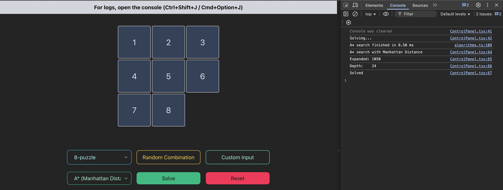

# 8 Puzzle

Bhagya Patel (862548221)
Done as part of Project 01 for the course CS205 taught by Dr. Eamonn Keogh at University of California, Riverside.

### Run Locally

- Clone the Repository
- Make sure you have `nodejs > 17.0` installed on your machine
- In the project root, run `npm install` to install required packages
- Once done, run `npm run dev` to start the server
- Visit `https://localhost:5173` on a modern browser of your choice.

